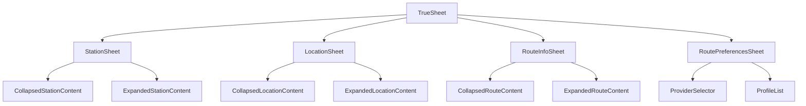

# Design Document: Bottom Sheet Cards

## Overview

This design refactors the existing card-based UI components to use TrueSheet bottom sheets, providing a consistent, native-feeling interaction pattern with proper scrolling support. The refactor addresses the current scrolling issues with popup menus (particularly in RoutePreferencesCard where only some profiles are visible) and creates a unified sheet-based UX across the app.

## Architecture

### Current State
```
┌─────────────────────────────────────────┐
│ MainMapView                             │
│  ├── StationCard (custom modal)         │
│  ├── LocationCard (custom modal)        │
│  ├── RouteInfoCard (custom modal)       │
│  └── RoutePreferencesCard (Modal+Menu)  │
└─────────────────────────────────────────┘
```

### Target State
```
┌─────────────────────────────────────────┐
│ MainMapView                             │
│  ├── StationSheet (TrueSheet)           │
│  ├── LocationSheet (TrueSheet)          │
│  ├── RouteInfoSheet (TrueSheet)         │
│  └── RoutePreferencesSheet (TrueSheet)  │
└─────────────────────────────────────────┘
```

### Component Hierarchy


## Components and Interfaces

### BaseSheet (Wrapper Component)

A reusable wrapper component that provides consistent TrueSheet behavior across all sheet implementations. This addresses Requirement 7 for maintainable, consistent sheet behavior.

```typescript
interface BaseSheetProps {
  name: string;                          // Unique name for programmatic control
  children: React.ReactNode;
  detents?: (number | 'auto')[];         // Snap points for sheet height
  initialDetentIndex?: number;           // Starting detent (0 = collapsed)
  onDismiss?: () => void;
  onDetentChange?: (index: number) => void;
  scrollable?: boolean;                  // Enable nested scrolling
  grabberVisible?: boolean;              // Show drag handle
}
```

**Design Rationale:**
- Wraps TrueSheet with consistent defaults (corner radius, blur/glass effects)
- Handles platform-specific styling (Liquid Glass on iOS 26+, blur fallback elsewhere)
- Provides named sheet registration for `TrueSheet.present('sheetName')` API
- Manages detent configuration with sensible defaults

**Platform-Specific Styling (Requirement 3):**
```typescript
const getSheetStyle = () => {
  const isIOS26Plus = Platform.OS === 'ios' && parseInt(Platform.Version, 10) >= 26;
  
  return {
    cornerRadius: 16,
    // TrueSheet handles Liquid Glass automatically on iOS 26+
    // Blur effect is the fallback on older iOS and Android
    blurTint: isIOS26Plus ? undefined : 'systemMaterial',
  };
};
```

### StationSheet

Replaces `StationCard`. Displays bikeshare station information with collapsed/expanded states.

```typescript
interface StationSheetProps {
  station: StationData | null;
  onClose: () => void;
  onGetDirections?: () => void;
  isLoadingDirections?: boolean;
}

interface StationData {
  id: string;
  name: string;
  coordinates: [number, number];
  classicBikes: number;
  electricBikes: number;
  availableDocks: number;
  availabilityStatus: string;
  address?: string;
  capacity?: number;
  isOperational?: boolean;
  isRenting?: boolean;
  isReturning?: boolean;
  lastReported?: string;
  networkName?: string;
}
```

**Detents:**
- Collapsed: `0.1` (10% screen) - Shows station name, bike counts
- Expanded: `0.9` (90% screen) - Shows full details with scrollable content

**Real-time Updates (Requirement 4.4):**
The StationSheet subscribes to station data changes via Supabase real-time subscriptions. When station availability changes, the component re-renders with updated data without requiring user interaction.

```typescript
// Real-time subscription handled in parent or via hook
const { data: station } = useRealtime('bikeshare.stations', {
  select: { filter: (query) => query.eq('id', stationId) }
});
```

### LocationSheet

Replaces `LocationCard`. Displays search result location information.

```typescript
interface LocationSheetProps {
  location: LocationData | null;
  onClose: () => void;
  onGetDirections?: () => void;
  isLoadingDirections?: boolean;
}

interface LocationData {
  name: string;
  display_name: string;
  lat: number;
  lon: number;
  type: string;
  mapbox_id: string;
}
```

**Detents:**
- Collapsed: `'auto'` (~100px) - Shows location name, address
- Expanded: `0.5` (50% screen) - Shows coordinates, type, actions

### RouteInfoSheet

Replaces `RouteInfoCard`. Displays calculated route information with turn-by-turn directions.

```typescript
interface RouteInfoSheetProps {
  route: DirectionsResponse | null;
  loading: boolean;
  error: string | null;
  profile: string;
  units: 'metric' | 'imperial';
  onClearRoute: () => void;
  onRecalculate?: (provider?: string, profile?: string) => void;
}
```

**Detents:**
- Collapsed: `'auto'` (~100px) - Shows distance, duration, profile icon
- Expanded: `0.85` (85% screen) - Shows turn-by-turn instructions

### RoutePreferencesSheet

Replaces `RoutePreferencesCard`. Allows selection of routing provider and profile.

```typescript
interface RoutePreferencesSheetProps {
  visible: boolean;
  onClose: () => void;
  onConfirm: () => void;
  mode?: 'initial' | 'recalculate';
}
```

**Detents:**
- Single detent: `'auto'` - Auto-sizes to content with scrollable profile list

**Key Changes:**
- Removes `react-native-popup-menu` dependency for profile selection
- Uses native ScrollView with `nestedScrollEnabled` for profile list
- Profiles displayed as tappable rows grouped by category

## Data Models

### Profile Grouping

```typescript
interface GroupedProfiles {
  [ProfileCategory.CYCLING]: ProfileMetadata[];
  [ProfileCategory.WALKING]: ProfileMetadata[];
  [ProfileCategory.DRIVING]: ProfileMetadata[];
  [ProfileCategory.OTHER]: ProfileMetadata[];
}

// Existing from use-provider-profiles.ts
interface ProfileMetadata {
  id: string;
  title: string;
  icon: string;
  category: ProfileCategory;
  description?: string;
}
```

### Sheet State Management

Each sheet manages its own presentation state via ref, with support for both ref-based and named sheet control (Requirement 7.3, 7.4):

```typescript
const sheetRef = useRef<TrueSheet>(null);

// Present sheet via ref
await sheetRef.current?.present();

// Dismiss sheet via ref
await sheetRef.current?.dismiss();

// Or use named sheets for programmatic control
TrueSheet.present('StationSheet');
TrueSheet.dismiss('StationSheet');

// Detent change handling for collapsed/expanded states
const handleDetentChange = (index: number) => {
  const isExpanded = index > 0;
  // Update UI based on expanded state
};
```

### Sheet Interaction Patterns (Requirement 2)

All sheets follow consistent interaction patterns:
- **Drag up**: Expands sheet to next detent
- **Drag down from collapsed**: Dismisses sheet
- **Drag down from expanded**: Collapses to previous detent
- **Tap outside**: Dismisses sheet (configurable)
- **Scrolling**: Enabled when content exceeds visible area in expanded state

## Correctness Properties

*A property is a characteristic or behavior that should hold true across all valid executions of a system-essentially, a formal statement about what the system should do. Properties serve as the bridge between human-readable specifications and machine-verifiable correctness guarantees.*

### Property 1: Profile Grouping Preserves All Profiles

*For any* array of profiles with mixed categories, grouping by category SHALL result in the sum of all grouped profiles equaling the original array length, and each profile SHALL appear in exactly one category group.

**Validates: Requirements 1.1**

### Property 2: Route Distance Formatting Round-Trip

*For any* distance value in meters (positive number), the formatted string SHALL contain a numeric value followed by a unit indicator (m, km, ft, or mi), and parsing the numeric portion back with unit conversion SHALL yield a value within 1% of the original.

**Validates: Requirements 6.1**

### Property 3: Route Duration Formatting Accuracy

*For any* duration value in seconds (non-negative integer), the formatted string SHALL contain time components (hours and/or minutes), and the sum of the displayed time components converted back to seconds SHALL equal the original duration (rounded to the nearest minute).

**Validates: Requirements 6.1**

### Property 4: Turn-by-Turn Instruction Completeness

*For any* route with legs containing steps, the rendered instruction list SHALL contain exactly as many instruction items as there are steps across all legs.

**Validates: Requirements 6.2**

## Error Handling

### Sheet Presentation Errors

- If sheet fails to present, log error and fall back to previous UI state
- If data is null/undefined when sheet opens, show appropriate empty state

### Profile Loading Errors

- Display error message in sheet if profiles fail to load
- Provide retry button to refetch profiles
- Cache successful responses to reduce API calls

### Route Calculation Errors

- Show error state in RouteInfoSheet with error message
- Provide option to retry or change preferences

## Testing Strategy

### Dual Testing Approach

This feature uses both unit tests and property-based tests:

- **Unit tests**: Verify specific examples, edge cases, and component rendering
- **Property-based tests**: Verify universal properties across all valid inputs

### Property-Based Testing

**Library**: `fast-check` (already available in the project ecosystem)

**Configuration**: Each property test runs minimum 100 iterations.

**Test Annotation Format**: Each property test MUST include a comment in this format:
```typescript
// **Feature: bottom-sheet-cards, Property 1: Profile Grouping Preserves All Profiles**
```

**Properties to Test:**

1. **Property 1: Profile Grouping** (Validates: Requirements 1.1)
   - Generate random arrays of profiles with various categories
   - Verify sum of grouped profiles equals original array length
   - Verify each profile appears in exactly one category group

2. **Property 2: Distance Formatting Round-Trip** (Validates: Requirements 6.1)
   - Generate random positive meter values
   - Format to display string with unit
   - Parse back and verify within 1% of original

3. **Property 3: Duration Formatting Accuracy** (Validates: Requirements 6.1)
   - Generate random non-negative second values
   - Format to hours/minutes display string
   - Verify time components sum to original (rounded to minute)

4. **Property 4: Instruction Completeness** (Validates: Requirements 6.2)
   - Generate random route structures with legs and steps
   - Verify rendered instruction count matches total step count

### Unit Tests

1. **Component Rendering**
   - StationSheet renders with station data
   - LocationSheet renders with location data
   - RouteInfoSheet renders with route data
   - RoutePreferencesSheet renders profile list
   - BaseSheet applies correct styling per platform

2. **User Interactions**
   - Profile selection updates state (Validates: 1.3)
   - Get Directions button triggers callback (Validates: 4.3, 5.3)
   - Close button dismisses sheet (Validates: 6.4)
   - Confirm button applies preferences (Validates: 1.4)

3. **Edge Cases**
   - Empty profile list
   - Station with zero bikes
   - Route with no steps
   - Very long station/location names
   - Detent configuration validation (Validates: 7.2)

4. **Real-time Updates**
   - StationSheet re-renders when station data changes (Validates: 4.4)

### Test File Organization

```
frontend-expo/
├── components/
│   ├── __tests__/
│   │   ├── BaseSheet.test.tsx
│   │   ├── StationSheet.test.tsx
│   │   ├── LocationSheet.test.tsx
│   │   ├── RouteInfoSheet.test.tsx
│   │   ├── RoutePreferencesSheet.test.tsx
│   │   └── sheet-utils.property.test.ts  # Property tests for utilities
│   ├── BaseSheet.tsx
│   ├── StationSheet.tsx
│   ├── LocationSheet.tsx
│   ├── RouteInfoSheet.tsx
│   └── RoutePreferencesSheet.tsx
├── utils/
│   ├── __tests__/
│   │   └── format-route.property.test.ts  # Property tests for formatting
│   └── format-route.ts                     # Distance/duration formatting utilities
```
